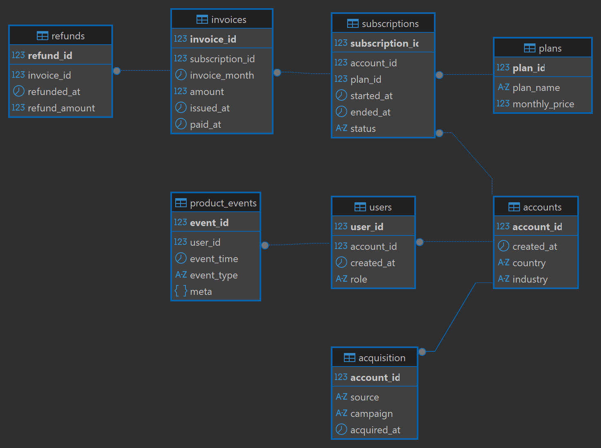

# 📊 SaaS SQL Analytics Project

A portfolio project focused on analytical SQL using a normalized SaaS subscription schema with synthetic data.  
The project simulates a subscription-based SaaS platform and demonstrates advanced SQL techniques including:

- CTEs
- Window functions
- Cohort analysis
- Revenue modeling (MRR / Net MRR)
- Churn signals
- Upgrade path analysis
- Billing quality checks

---
## Database Schema (ERD)

<p align="center">
  
</p>

---

## 🏗 Project Structure

saas-sql-analytics/  
├─ docs/  
├─ sql/  
├─ results/  
├─ runbook/  


### 📁 `docs/`
- ERD diagram
- Data dictionary
- Metrics definitions
- Synthetic data logic
- Problem statements

### 📁 `sql/`
Organized by analytical domain:

- `00_setup/`
- `01_mrr/`
- `02_retention/`
- `03_activation/`
- `04_churn/`
- `05_billing_quality/`
- `06_attribution/`
- `07_power_users/`
- `08_upgrades/`

Each folder contains standalone SQL analytical queries.

### 📁 `results/`
- Sample CSV outputs
- Screenshots of query results

### 📁 `runbook/`
- Database setup instructions
- How to execute the project

---

## 📌 Tasks

Problem statements:  
👉 [`docs/tasks.md`](docs/tasks.md)

Each task corresponds to one analytical SQL file inside the `sql/` directory.

---

## 🧪 Synthetic Data

The dataset is fully synthetic and generated using PostgreSQL functions such as:

- `generate_series()`
- `random()`
- `LATERAL joins`

Data generation scripts:

```sql
sql/00_setup/
```


Full explanation:
👉 [`docs/data_generation.md`](docs/data_generation.md)

---

## 📈 Analytical Topics Covered

- Gross MRR, Refunds, Net MRR
- Month-over-Month growth
- Top plan by revenue
- Cohort retention (logo retention)
- Time-to-First-Value (TTFV)
- Churn early warning (usage drop detection)
- Expansion vs Contraction billing
- Duplicate billing detection
- Marketing attribution validation
- Pareto (80/20 usage rule)
- Plan upgrade paths

---

## ⚙️ How to Run

See full instructions:

👉 [`runbook/dbeaver_setup.md`](runbook/dbeaver_setup.md)  
👉 [`runbook/how_to_run.md`](runbook/how_to_run.md)

---

## ⚠ Data Disclaimer

All data used in this project is fully synthetic and generated for educational purposes.

No real user or company data is included.

---

## 🎯 Project Goal

This project was built to simulate real-world analytical workflows on operational SaaS data.

The database is intentionally normalized (OLTP-style), requiring analytical queries to derive business metrics from transactional data.

---

## 📎 License

MIT License


The goal is to analyze subscription revenue, 
retention, churn signals, and user behavior using
advanced SQL (windows function, CTEs, cohort logic).
